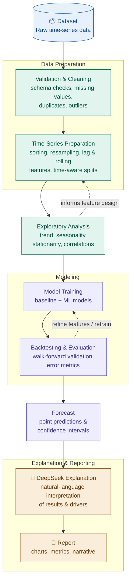

# Economic Intelligence System

## Pipeline Architecture Diagram

```mermaid
flowchart TD
    A[("📦 Dataset<br/>Raw time-series data")]

    subgraph PREP["Data Preparation"]
        B["Validation & Cleaning<br/>schema checks, missing values,<br/>duplicates, outliers"]
        C["Time-Series Preparation<br/>sorting, resampling, lag & rolling<br/>features, time-aware splits"]
    end

    D["Exploratory Analysis<br/>trend, seasonality,<br/>stationarity, correlations"]

    subgraph MODEL["Modeling"]
        E["Model Training<br/>baseline + ML models"]
        F["Backtesting & Evaluation<br/>walk-forward validation,<br/>error metrics"]
    end

    G["Forecast<br/>point predictions &<br/>confidence intervals"]

    subgraph EXPLAIN["Explanation & Reporting"]
        H["🤖 DeepSeek Explanation<br/>natural-language interpretation<br/>of results & drivers"]
        I["📄 Report<br/>charts, metrics, narrative"]
    end

    A --> B --> C --> D --> E --> F --> G --> H --> I
    F -. "refine features / retrain" .-> E
    D -. "informs feature design" .-> C

    classDef data fill:#E6F1FB,stroke:#185FA5,color:#0C447C
    classDef proc fill:#E1F5EE,stroke:#0F6E56,color:#085041
    classDef ml fill:#EEEDFE,stroke:#534AB7,color:#3C3489
    classDef out fill:#FAEEDA,stroke:#854F0B,color:#633806

    class A data
    class B,C,D proc
    class E,F,G ml
    class H,I out
```
